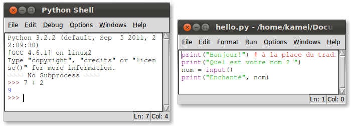
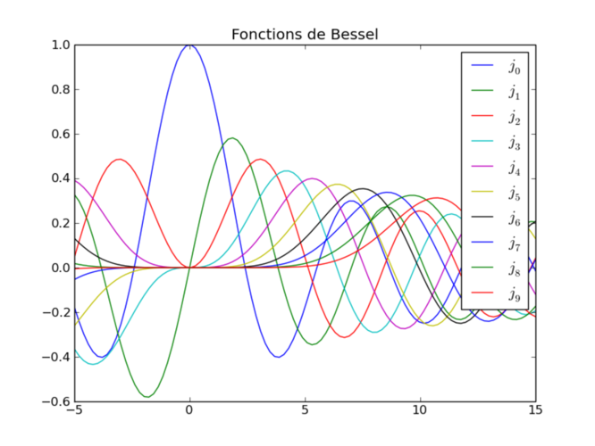
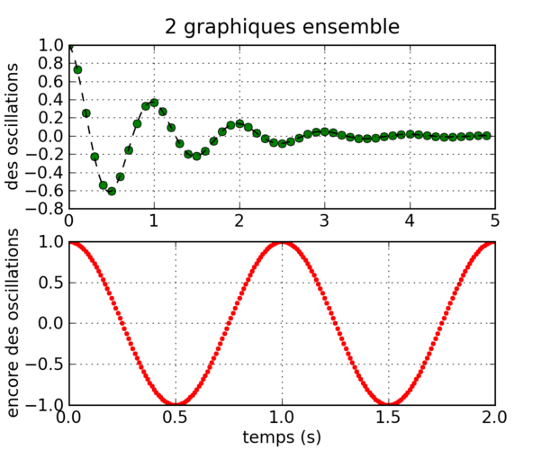
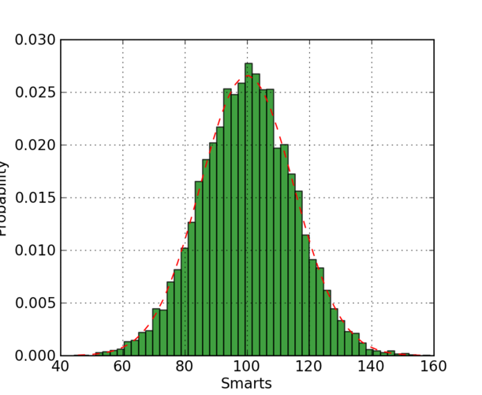
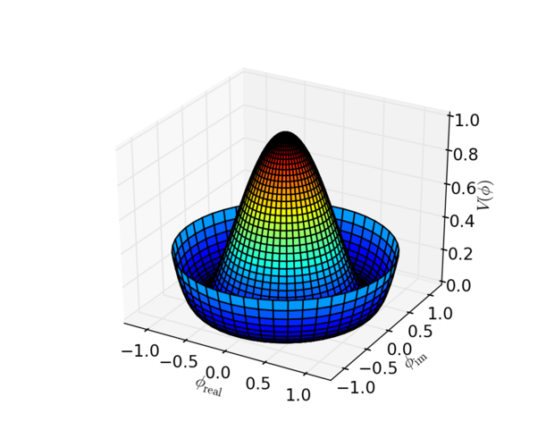

# Python pour l'algorithmique et ... #

<h1 align="right" style="font-size:50px"> ... pour les mathématiques </h1>

----
# Historique #

Développé en 1989 par Guido van Rossum.

En 2005, il a été engagé par Google pour ne travailler que sur Python.

Les deux versions récentes de Python :

- la 2.7
- la 3.2

----
# Caractéristiques #

- Libre et gratuit

- Interprété (pas besoin de compilation)

- peut être interactif (on peut s'en servir comme une calculatrice)

- Impératif / Fonctionnel / Orienté Objet

- Extensible (par exemple avec des modules graphiques)

----
# The Zen of Python #

* Syntaxe claire et cohérente

* Indentation significative (lisibilité du code)

* Typage dynamique (pas de déclaration de variables)

----
# The Zen of Python #

	!pycon
	>>> import this
	The Zen of Python, by Tim Peters

	Beautiful is better than ugly.
	Explicit is better than implicit.
	Simple is better than complex.
	Complex is better than complicated.
	Flat is better than nested.
	Sparse is better than dense.
	Readability counts.
	Special cases aren't special enough to break the rules.
	Although practicality beats purity.
	Errors should never pass silently.
	Unless explicitly silenced.
	In the face of ambiguity, refuse the temptation to guess.
	There should be one-- and preferably only one --obvious way to do it.
	Although that way may not be obvious at first unless you're Dutch.
	Now is better than never.
	Although never is often better than *right* now.
	If the implementation is hard to explain, it's a bad idea.
	If the implementation is easy to explain, it may be a good idea.
	Namespaces are one honking great idea -- let's do more of those!

----
# Installation #

- Pour une installation sur le réseau informatique d'un établissement,
mieux vaut laisser le responsable TICE s'en occuper.

- Pour une installation sur son propre ordinateur,
plusieurs solutions possibles pour chaque système d'exploitation :

	* avec GNU/Linux ou Mac, Python est souvent déjà installé
	* avec Windows, par exemple installer [AmiensPython](http://amienspython.tuxfamily.org/).

Mais quelque soit le système d'exploitation, on peut l'utiliser dans un terminal
ou avec [IDLE](http://docs.python.org/library/idle.html)

----
# Utilisation #

- Avec l'interpréteur : on s'en sert un peu comme une calculatrice.

- Avec l'éditeur : on écrit un programme dans n'importe quel éditeur de texte,
puis on l'exécute à l'aide d'un terminal :

        !bash
        $ python nom_du_fichier.py

----
# Quelques rudiments #

----
# Types et affectation #

- entier (int)
- flottant (float)
- chaîne de caractères (string)
- liste (list)
- ... (...)

Pour affecter une valeur à une variable, on utilise le signe ``=``.

	!pycon
	>>> a = 3
	>>> a = a + 1
	>>> a
	4
	>>> b = "une chaine"
	>>> # Et pour l'égalité ?
	...
	>>> a == 9
	False
	>>> a == 4
	True

----
# Les opérations #

    !pycon
    >>> 12 - 2*5
    2
    >>> 3**2
    9

Cas particulier de la division

	!pycon
	>>> 5/2                              			# Ici avec Python 2.x
	2
	>>> from __future__ import division
	>>> 5/2
	2.5
	>>> 5//2
	2

C'est plus simple avec la dernière version.

	!pycon
	>>> 5/2                              			# Ici avec Python 3.x
	2.5
	>>> 5//2
	2

----
# Des fonctions prédéfinies #

* ``print`` et ``input``
* ``len``, ``list`` et ``range``
* ``complex`` et ``abs``
* ``min`` et ``max``
* ``round``
* ``sum``

Du point de vue mathématique, ce serait très limité si on s'arrêtait là.

----
# Plus de fonctions grâce aux modules #

On peut importer des modules supplémentaires.
Cela permet de travailler avec plus de fonctions.

    !python
    from math import cos

ou carrément

    !python
    from math import *
    z = cos(pi)*sqrt(2)
    print(z)
    
pour tout importer.

----
# Quelques modules #

- math (``pi``, ``e``, ``cos``, ``sin``, ``tan``, ``exp``, ...)
- random (``choice``, ``random``, ``randint``, ...)
- numpy ( les mêmes que math plus tout ce qui tourne autour de ``array`` ... )
- matplotlib ( ``plot``, ...)
- mpmath (``plot`` aussi ...)

Il y en a beaucoup d'autres.

----
# Exemples de graphiques avec Matplotlib #

----
# Un autre exemple de graphique avec Matplotlib #

----
# Encore un exemple de graphique avec Matplotlib #

----
# Un dernier pour la route #

----
# Un pas dans l'algorithmique #

----
# Définition de fonction #

D'abord une fonction d'une seule variable :

	!python
	def f(x):
		y = x + 3
		y = y**2
		y = y + 5
		return y

Puis une fonction de deux variables:

    !python
    def g(x, y):
        return 2*x - 3*y

----
# Un pas de plus vers l'algorithmique #

----
# Tests #

    !python
    if a > 0:
        print("strictement positif")
    else:
        print("négatif ou nul")

Un test pour la définition d'une fonction affine par morceaux :

	!python
	def g(x):
		if x < 2:
			return 3*x - 1
		else:
			return -x + 7

----
# Boucles ``POUR`` #

Par exemple :

    !pycon
    >>> for k in range(4):
    ...    print("blabla")
    ...
    blabla
    blabla
    blabla
    blabla
    >>> list(range(4))
    [0, 1, 2 , 3]

Ou encore :

    !python
    for k in [2, 5, 8, 11, 14]:
        print(k*k - 2*k)

Ce qui est équivalent à :

    !python
    for k in range(2, 15, 3):
        print(k*k - 2*k)

----
# Boucles ``TANT_QUE`` #

	!pycon
	>>> i = 1
	>>> while i <= 5:
	...     print(i)
	...     i = i + 1
	...
	1
	2
	3
	4
	5

----
# Des listes plutôt mathématiques #

----
# Listes en compréhension #

Pour obtenir la liste des entiers naturels de la forme $5n + 3$ :

	!pycon
	>>> [x for x in range(51) if x % 5 == 3]
	[3, 8, 13, 18, 23, 28, 33, 38, 43, 48]

La liste des valeurs d'une fonction $f$ défine sur $[0~;~5]$ par $f(x)=x^2+1$ :

	!pycon
	>>> def f(x): return x**2 + 1
	...
	>>> abscisses = range(6)
	>>> ordonnees = [f(x) for x in range(6)]
	>>> points = zip(abscisses, ordonnees)
	>>> print(points)
	[(0, 1), (1, 2), (2, 5), (3, 10), (4, 17), (5, 26)]
	
Pratique pour calculer certaines sommes :

	!pycon
	>>> sum([n**2 for n in range(11)])
	385

----
# Calcul numérique #

Attention, comme avec les calculatrices, les résultats sont approchées.

	!pycon
	>>> from math import sqrt
	>>> a = sqrt(2)
	>>> b = sqrt(3)
	>>> c = sqrt(5)
	>>> # testons maintenant une égalité
	...
	>>> a**2 + b**2 == c**2
	False

Et pourtant $ (\\sqrt{2})^2 + (\\sqrt{3})^2 = (\\sqrt{5})^2 $

----
# Peut-on faire du calcul formel avec Python ? #

----
# Sympy et Sage #

Si vous voulez :

* développer ou factoriser des expressions,
* résoudre des équations ou systèmes d’équations,
* dériver des fonctions,
* calculer des intégrales,
* ...

 et tout ceci de façon exacte, alors les deux solutions ci-dessous peuvent
 répondre à vos besoins :

- **Sympy** est un module de Python.

- **Sage** est un logiciel de calcul mathématique,
qui fait entre autres du calcul formel
et dont le langage est Python.

----
# Quelques liens utiles #

* [http://python.org/](http://python.org/)
* [http://python.lycee.free.fr](http://python.lycee.free.fr)
* [http://matplotlib.sourceforge.net/](http://matplotlib.sourceforge.net/)
* [http://www.sagemath.org/fr/](http://www.sagemath.org/fr/)

.

	!python
	##########################################################################
	# Présentation réalisée avec Landslide.                                  #
	#                                                                        #
	#                                                                        #
	#											  Kamel Naroun et M. Gragnic #
	##########################################################################
